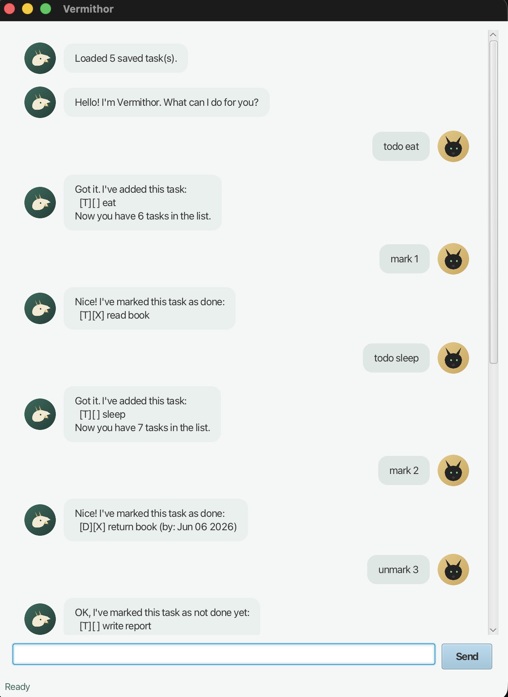

# Vermithor User Guide

Vermithor is a desktop task manager for people who like typing. Add todos, deadlines, and
events, mark them done, search, sort, and let Vermithor remember everything between
sessions — all from a single command line, in either the JavaFX GUI or the text-based CLI.



## Quick start

1. Ensure you have Java 25 installed (the Azul Zulu JDK distribution is recommended on macOS).
2. Download `vermithor.jar` from the [latest release](https://github.com/GowrinathJK/ip/releases/latest).
3. Copy the jar into an empty folder, open a terminal there, and run:
   ```
   java -jar vermithor.jar
   ```
4. Type a command in the input box (GUI) or at the prompt (CLI) and press Enter. Some
   commands to try first:
   - `todo read a book`
   - `list`
   - `find book`
   - `sort`

## Features

### Adding a todo: `todo`
Adds a task with no date or time attached.

Format: `todo DESCRIPTION`

Example: `todo read a book`

```
Got it. I've added this task:
  [T][ ] read a book
Now you have 1 tasks in the list.
```

### Adding a deadline: `deadline`
Adds a task that must be done by a specific date.

Format: `deadline DESCRIPTION /by DATE` — `DATE` must be in `yyyy-MM-dd` format.

Example: `deadline submit report /by 2026-09-18`

```
Got it. I've added this task:
  [D][ ] submit report (by: Sep 18 2026)
Now you have 2 tasks in the list.
```

### Adding an event: `event`
Adds a task that spans a start time and an end time.

Format: `event DESCRIPTION /from START /to END`

Example: `event project meeting /from Mon 2pm /to 4pm`

```
Got it. I've added this task:
  [E][ ] project meeting (from: Mon 2pm to: 4pm)
Now you have 3 tasks in the list.
```

### Listing all tasks: `list`
Shows every saved task, numbered in its current display order.

Format: `list`

### Marking a task as done: `mark`
Format: `mark TASK_NUMBER`

Example: `mark 2`

### Marking a task as not done: `unmark`
Format: `unmark TASK_NUMBER`

Example: `unmark 2`

### Deleting a task: `delete`
Removes a task from the list permanently.

Format: `delete TASK_NUMBER`

Example: `delete 3`

### Finding tasks: `find`
Shows tasks whose description contains the given keyword (case-insensitive).

Format: `find KEYWORD`

Example: `find book`

### Sorting tasks: `sort`
Reorders the task list alphabetically by description. This updates the saved order, so
task numbers after a `sort` refer to the new order, not the order tasks were originally
added in.

Format: `sort`

### Exiting: `bye`
Saves your tasks and closes Vermithor, including the GUI window if one is open.

Format: `bye`

## Saving the data
Vermithor automatically saves your tasks to `data/vermithor.txt`, relative to the folder
you launched it from, after every change — there is nothing you need to do manually. Tasks
are reloaded automatically the next time Vermithor starts. If a single saved line is
corrupted (for example, from manual editing), Vermithor skips just that line instead of
discarding the rest of your tasks.

## Command summary
| Command | Format | Example |
| --- | --- | --- |
| Todo | `todo DESCRIPTION` | `todo read a book` |
| Deadline | `deadline DESCRIPTION /by DATE` | `deadline submit report /by 2026-09-18` |
| Event | `event DESCRIPTION /from START /to END` | `event meeting /from Mon 2pm /to 4pm` |
| List | `list` | `list` |
| Mark | `mark TASK_NUMBER` | `mark 1` |
| Unmark | `unmark TASK_NUMBER` | `unmark 1` |
| Delete | `delete TASK_NUMBER` | `delete 1` |
| Find | `find KEYWORD` | `find book` |
| Sort | `sort` | `sort` |
| Exit | `bye` | `bye` |

## Troubleshooting
- **"I don't know that command"** — check spelling; commands are case-insensitive but
  must match one of the words listed above.
- **Errors right after startup** — confirm you are running Java 25 (`java -version`) and
  that the folder you launched the jar from is writable, since Vermithor needs to create a
  `data` folder next to it.
- **A saved task looks wrong or missing after a manual edit** — Vermithor skips individual
  corrupted lines in `data/vermithor.txt` rather than losing every task; if you hand-edit
  that file, keep the `TYPE|done|...` pipe-separated format for each line.
